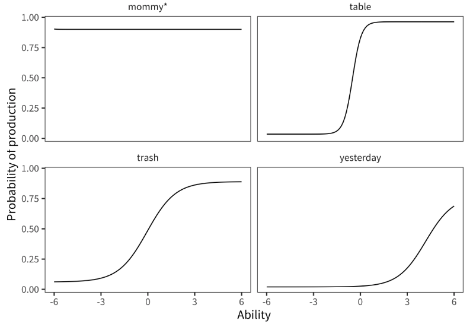
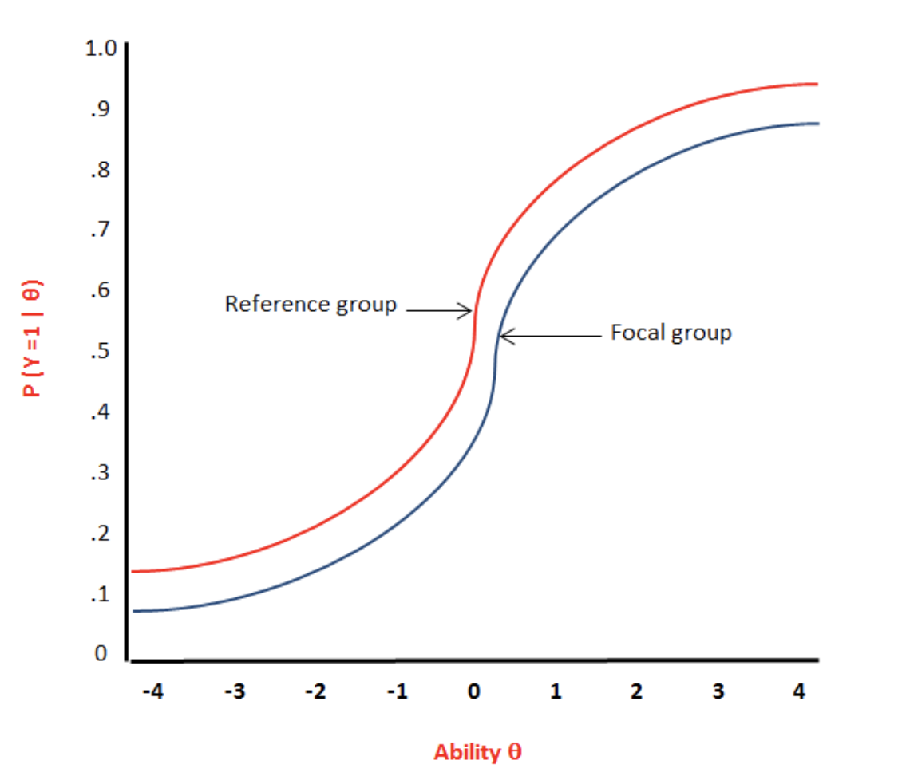
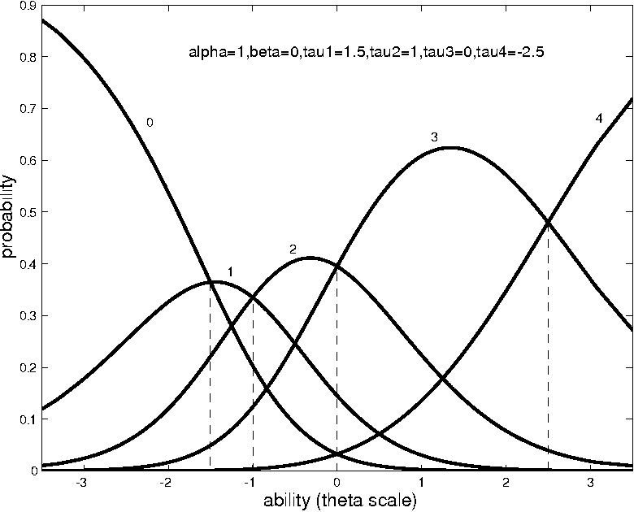
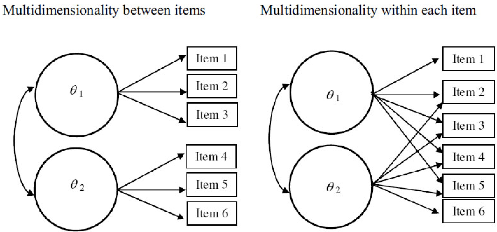

```{r setup, include=FALSE}
knitr::opts_chunk$set(echo = FALSE, dpi = 300, out.width = 500)

library(tidyverse)
library(mirt)

theme_set(theme_bw(base_size = 20))
```

# The power of Item Response Theory (IRT)

In a world with and more big and naturally-occuring data, IRT offers a few promises:

--

1. Understand and leverage item variability

--

2. More precise measures of latent constructs

--

3. More information with fewer data points

---

# Wordbank example

Wordbank (wordbank.stanford.edu) provides open source data from over 80k MacArthur-Bates Communicative Development Inventory (MB-CDI) administrations.

```{r, out.width=600}

```

---

# Warm up: Answer with a partner

1. Who is the highest ability person? Who is the lowest ability person?
2. Which item is the hardest? Which is the easiest?
3. Who has a higher ability between person D and person I?				
4. Estimate the probability of person G getting item 2 correct.

<small>

```{r, message = FALSE}
read_csv("data-clean/item_responses_simple.csv") %>% 
  knitr::kable(format = 'html')
```

</small>

---

# What is measurement? 

--

1. You're interested in a latent construct (math ability, extroversion, anxiety etc.)

--

2. You measure that latent construct by giving people items (which we'll call a test)

--

3. You do some science with that measurement

---

# Relevant questions

--

1. Is this a good test? Are some items better than others?

--

2. Does this test measure the latent construct I care about?

--

3. Is this test fair?

--

4. How do we get from responses to the items to the measure of latent trait?

---

# How do I get from responses to the latent trait?

<small>

```{r, message =  FALSE}
read_csv("data-clean/item_responses_specific.csv") %>%
  knitr::kable(format = 'html')
```

</small>

---

# The sum score

--

1. What assumptions does it make?

2. What are its limitations?

---

# The sum score

## Assumptions

1. Items are equally difficult

--

2. Items are equally related to the latent construct

--

3. 1 on all items is positively related to the construct

--

## Limitations

--

1. How do I handle missing data?

--

2. How do I make predictions? 

--

3. How do I make an adaptive test?

---

# Item Response Theory (IRT) to the rescue!

A parametric framework for item response data

--

Each person $p$ has an ability $\theta_p$

--

Each item $i$ has an easiness $b_i$

--

These combine to give the probability of correct response

---

# The logistic function

We use the logistic $\sigma(x) = \dfrac{\exp(x)}{1 + \exp(x)}$ function to map the sum of ability and easiness to probability of correct response

--

```{r, out.width = 400}
logistic <- function(x) {exp(x) / (1 + exp(x))}

tibble(
  sum = seq(-4, 4, 0.1),
) %>% 
  mutate(p = logistic(sum)) %>% 
  ggplot(aes(x = sum, y = p)) +
  geom_path(size = 3) +
  scale_y_continuous(labels = scales::percent) +
  labs(
    x = "Sum of person ability and item easiness",
    y = "Probability of correct",
    title = ""
  )
```

---

# Looking at easiness

```{r}
different_item_easiness <- 
  tibble(
    ability = seq(-6, 6, 0.1)
  ) %>% 
  mutate(
    `easiness = -2` = logistic(ability + -2),
    `easiness = 0` = logistic(ability + 0),
    `easiness = 2` = logistic(ability + 2)
  ) %>% 
  gather(item, p, -ability) %>% 
  mutate(
    item = factor(item, levels = c("easiness = 2", "easiness = 1", "easiness = 0", "easiness = -1", "easiness = -2"))
  ) %>% 
  ggplot(aes(x = ability, y = p, color = item)) +
  geom_path(aes(group = item), size = 2) +
  scale_y_continuous(labels = scales::percent) +
  labs(
    x = "Person ability",
    y = "Probability of correct",
    title = ""
  ) +
  theme(legend.position = "bottom")

different_item_easiness
```

---

# Question: Probability of responses

1. Calculate P(correct, correct, incorrect | ability = 0)

2. Calculate P(correct, correct, incorrect | ability = 1)

```{r, out.width = 400}
different_item_easiness
```

---

# Answer: Probability of responses

```{r, echo = TRUE}
logistic <- function(x) {exp(x) / (1 + exp(x))}
```

--

1. Calculate P(correct, correct, incorrect | ability = 0)

```{r, echo = TRUE}
logistic(2 + 0) * logistic(0 + 0) * (1 - logistic(-2 + 0))
```

--

2. Calculate P(correct, correct, incorrect | ability = 1)

```{r, echo = TRUE}
logistic(2 + 1) * logistic(0 + 1) * (1 - logistic(-2 + 1))
```

---

# IRT in practice

We'll show the power of IRT with the Wordbank data (wordbank.stanford.edu) 

```{r, message = FALSE}
words <- c("yum yum", "bee", "cockadoodledoo", "buy", "camping", "moo", "ouch", "aunt")

english_words <- 
  read_csv("data-clean/english_words.csv") %>% 
  select(sex, age, one_of(words))

english_words %>% 
  head() %>% 
  knitr::kable(format = 'html')
```

---

# Items 

```{r, message = FALSE}
english_words %>% 
  select(-sex, -age) %>% 
  apply(2, mean) %>% 
  enframe() %>% 
  mutate(animal = fct_reorder(name, value)) %>% 
  ggplot(aes(x = animal, y = value)) +
  geom_col() +
  coord_flip() +
  scale_y_continuous(labels = scales::percent) +
  labs(
    y = "Percent of kids that produce the word"
  )
```

---

# Children

```{r, message = FALSE}
english_words %>% 
  mutate(sum_score = apply(select(., -sex, -age), 1, sum)) %>%  
  ggplot(aes(x = sum_score)) +
  geom_histogram() +
  facet_wrap(~ sex, ncol = 1)
```

---

# Fit item parameters

## code

```{r, echo = TRUE}
irt_model_rasch <- 
  mirt(
    data = english_words %>% select(-sex, -age),
    model = 1,
    itemtype = "Rasch",
    verbose = FALSE
  )
```

---

## item curves

```{r}
plot(irt_model_rasch, type = "trace")
```

---

# Ability Estimates

```{r}
abilities <- 
  english_words %>% 
  mutate(sum_score = apply(select(., -sex, -age), 1, sum)) %>%  
  select(sex, age, sum_score) %>% 
  mutate(theta_rasch = fscores(irt_model_rasch)[ , 1])

abilities %>% head() %>% knitr::kable(format = 'html')
```

---

# Ability estimates by sex

```{r, message = FALSE}
abilities %>%  
  ggplot(aes(x = theta_rasch)) +
  geom_histogram() +
  facet_wrap(~ sex, ncol = 1)
```

---

# Wait a second

```{r}
abilities %>% 
  ggplot(aes(x = sum_score, y = theta_rasch)) +
  geom_point(size = 3)
```

---

# Moving from Rasch to 2PL 

## Rasch

Each person has ability $\theta_p$. Each item has easiness $b_i$.

$P(y_{pi} = 1 | \theta_p, b_i) = \sigma(\theta_p + b_i)$

where

$\sigma(x) = \dfrac{\exp(x)}{1 + \exp(x)}$

--

## 2PL 

Each person has ability $\theta_p$. Each item has easiness $b_i$ and discrimination $a_i$.

$P(y_{pi} = 1 | \theta_p, b_i, a_i) = \sigma(a_i \cdot \theta_p + b_i)$

---

# Discrimination 

The discrimination $a_i$ describes the strength of the relationship between the item and ability

--

```{r, out.width = 425}
different_item_disc <- 
  tibble(
    ability = seq(-6, 6, 0.1)
  ) %>% 
  mutate(
    `discrimination = 0.5` = logistic(0.5 * ability),
    `discrimination = 1` = logistic(1 * ability),
    `discrimination = 2` = logistic(2 * ability),
    `discrimination = 3` = logistic(3 * ability)
  ) %>% 
  gather(item, p, -ability) %>% 
  mutate(
    item = 
      factor(
        item, 
        levels = c("discrimination = 0.5", "discrimination = 1", "discrimination = 2", "discrimination = 3")
      )
  ) %>% 
  ggplot(aes(x = ability, y = p, color = item)) +
  geom_path(aes(group = item), size = 2) +
  scale_y_continuous(labels = scales::percent) +
  labs(
    x = "Person ability",
    y = "Probability of correct",
    title = "All items have easiness = 0"
  ) +
  theme(legend.position = "bottom")

different_item_disc
```

---

# Question: Weighting

Which of the outcomes is more likely for a person with ability $\theta_p = 2$? (The easiness of each item is 0).

```{r}
tibble(
  `item discrimination` = c(0.5, 1, 2, 3),
  `outcome 1` = c("correct", "incorrect", "incorrect", "correct"),
  `outcome 2` = c("correct", "correct", "correct", "incorrect")
) %>% 
  knitr::kable(format = 'html')
```

---

# Answer: Weighting

Which of the outcomes is more likely for a person with ability $\theta_p = 2$? (The easiness of each item is 0).

--

Outcome 1

```{r, echo = TRUE}
logistic(0.5 * 2 + 0) * 
  (1 - logistic(1 * 2 + 0)) * 
  (1 - logistic(2 * 2 + 0)) * 
  logistic(3 * 2 + 0)
```

--

Outcome 2

```{r, echo = TRUE}
logistic(0.5 * 2 + 0) * 
  logistic(1 * 2 + 0) * 
  logistic(2 * 2 + 0) * 
  (1 - logistic(3 * 2 + 0))
```

---

# Fit 2PL model

## code

```{r, echo = TRUE}
irt_model_2pl <-
  mirt(
    data = english_words %>% select(-sex, -age),
    model = 1,
    itemtype = "2PL",
    verbose = FALSE
  )
```

---

## item curves

```{r}
plot(irt_model_2pl, type = "trace")
```

---

# 2PL item parameters

```{r}
coef(irt_model_2pl, simplify = TRUE)$items %>%
  as_tibble() %>% 
  mutate(item = row.names(coef(irt_model_2pl, simplify = TRUE)$items)) %>% 
  ggplot(aes(x = d, y = a1)) +
  geom_point(size = 3) +
  ggrepel::geom_text_repel(aes(label = item), size = 6) +
  labs(
    x = "Easiness",
    y = "Discrimination"
  )
```

---

# 2PL abilities

```{r, dpi = 300}
abilities <- 
  abilities %>% 
  mutate(theta_2pl = fscores(irt_model_2pl)[ , 1])

abilities %>% 
  ggplot(aes(x = sum_score, y = theta_2pl)) +
  geom_point(alpha = 0.1, size = 3)
```

---

# Why stop at 2 item parameters?

--

## 2PL 

Each person has ability $\theta_p$. Each item has easiness $b_i$ and discrimination $a_i$.

$P(y_{pi} = 1 | \theta_p, b_i) = \sigma(a_i \cdot \theta_p + b_i)$

--

## What might a 3rd item parameter do?

---

# 3PL 

Each person has ability $\theta_p$. Each item has easiness $b_i$, discrimination $a_i$, and guessability $g_i$.

$P(y_{pi} = 1 | \theta_p, a_i, b_i, g_i) = g_i + (1 - g_i) \cdot \sigma(a_i \cdot \theta_p + b_i)$

---

# Intuition behind each of the 3 parameters

- Easiness is horizontal translation

- Discrimination is slope

- Guessability is starting point at ability negative infinity

```{r, out.width = 450}
different_item_3pl <- 
  tibble(
    ability = seq(-6, 6, 0.1)
  ) %>% 
  mutate(
    `hard, low disc, guessable` = 0.4 + 0.6 * logistic(0.75 * ability - 1.5),
    `easy, high disc, not guessable` = 0.1 + 0.9 * logistic(2 * ability + 1.5)
  ) %>% 
  gather(item, p, -ability) %>% 
  ggplot(aes(x = ability, y = p, color = item)) +
  geom_path(aes(group = item), size = 2) +
  scale_y_continuous(labels = scales::percent) +
  labs(
    x = "Person ability",
    y = "Probability of correct"
  ) +
  theme(legend.position = "bottom")

different_item_3pl
```

---

# Fit 3PL model

## code

```{r, echo = TRUE}
irt_model_3pl <-
  mirt(
    data = english_words %>% select(-sex, -age),
    model = 1,
    itemtype = "3PL",
    verbose = FALSE
  )
```

---

## item curves

```{r, dpi = 300}
plot(irt_model_3pl, type = "trace")
```

---

# 3PL item parameters

```{r}
coef(irt_model_3pl, simplify = TRUE)$items %>%
  as_tibble() %>% 
  mutate(item = row.names(coef(irt_model_3pl, simplify = TRUE)$items)) %>%
  select(item, a1, b = d, g) %>% 
  mutate_at(vars(a1:g), round, 2) %>% 
  knitr::kable(format = "html")
```

---

# 3PL abilities - compare to 2PL

```{r}
abilities <- 
  abilities %>% 
  mutate(theta_3pl = fscores(irt_model_3pl)[ , 1])

abilities %>% 
  ggplot(aes(x = theta_2pl, y = theta_3pl)) +
  geom_point(alpha = 0.1, size = 3)
```

---

# 3PL abilities - compare to sum score

```{r}
abilities %>% 
  ggplot(aes(x = sum_score, y = theta_3pl)) +
  geom_point(alpha = 0.1, size = 3)
```

---

# Comparing sexes

```{r, message = FALSE}
abilities %>% 
  ggplot(aes(x = theta_3pl)) +
  geom_histogram() +
  facet_wrap(~ sex, ncol = 1)
```

---

# Comparing ages

```{r}
abilities %>% 
  group_by(age) %>% 
  summarize(mean_sum_score = mean(sum_score), mean_theta_3pl = mean(theta_3pl)) %>% 
  gather(var, val, -age) %>% 
  ggplot(aes(x = age, y = val)) +
  geom_point(size = 3) +
  facet_wrap(~ var, scale = "free_y", ncol = 1) +
  labs(
    y = ""
  )
```

---

# Differential item functioning (DIF)

```{r, out.width=500}

```

---

# Polytymous item response theory

```{r, out.width = 500}

```

---

# Multidimensional models

```{r, out.width = 600}

```

---

# Learning more 

- Most popular way to estimate is the mirt R package written by Phil Chalmers

- Phil Chalmers has some good workshop materials on [his GitHub](https://github.com/philchalmers/mirt/wiki)

- Mike Frank reccommends the Embretson & Reise book [Item Response Theory for Psychologists](https://www.amazon.com/Response-Theory-Psychologists-Multivariate-Applications/dp/0805828192)

- Great resources on Bayesian Item Response Theory with at education-stan.github.io

- [Exercise](https://github.com/stenhaug/irt-basics/blob/master/exercise.Rmd) associated with this presentation

---

# Getting in touch

Ben Stenhaug

benstenhaug.org

stenhaug@stanford.edu
